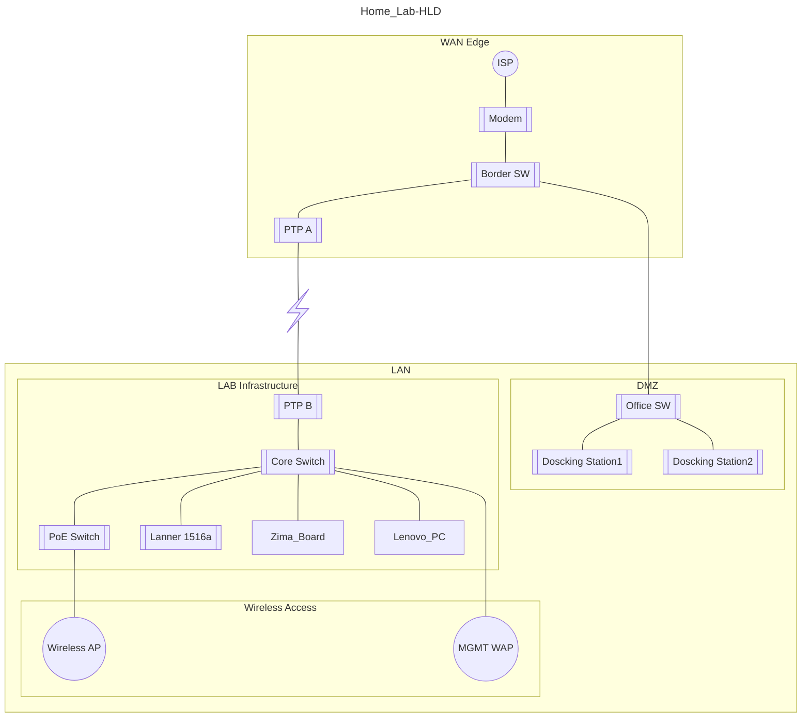
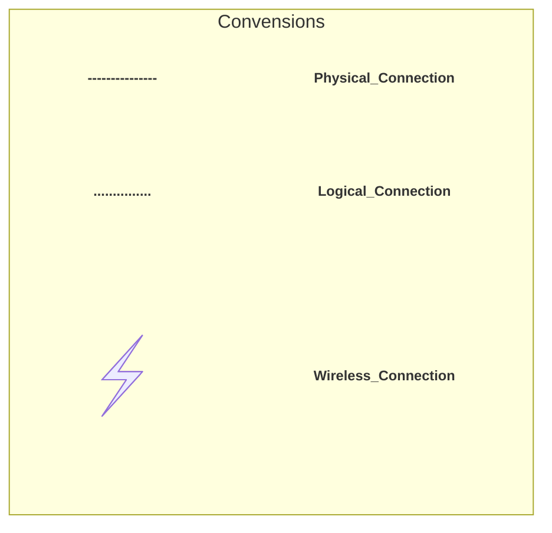

```mermaid
---
title: Home_Lab-HLD
---
flowchart TB

  %% WAN EDGE
  subgraph WAN_EDGE ["WAN Edge"]
    direction TB
    ISP((ISP))
    Modem[[Modem]]
    SW1[[Border SW]]
    PTPA[[PTP A]]
    ISP --- Modem
    Modem --- SW1
    SW1 --- PTPA
    end

  subgraph LAN
  direction LR
  %%DMZ
    subgraph DMZ
      direction TB
      SW2[[Office SW]]
      Dock1[[Doscking Station1]]
      Dock2[[Doscking Station2]]
      SW2 --- Dock1
      SW2 --- Dock2
    end

  %% LAN INFRASTRUCTURE
    subgraph LAB ["LAB Infrastructure"]
      direction TB
      PTPB[[PTP B]]
      LAN_SW[[Core Switch]]
      PoE_SW[[PoE Switch]]   
      Lanner[[Lanner 1516a]]
      PTPB --- LAN_SW
      LAN_SW --- PoE_SW
      LAN_SW --- Lanner
      LAN_SW --- Zima_Board
      LAN_SW --- Lenovo_PC

    end
    subgraph wireless_access ["Wireless Access"]
      WAP((Wireless AP))
      MGMT_WAP((MGMT WAP))
      PoE_SW --- WAP
      LAN_SW --- MGMT_WAP  
    end
  end

  PTPA ---A--- PTPB
  A@{ shape: bolt, label: "Communication link" }
  SW1 --- SW2
```

```mermaid
%% ---
%% title: Convensions
%% ---
flowchart TB
subgraph Convensions
Solid["---------------"]
Dotted["..............."]
subgraph Bolt[" "]
A@{ shape: bolt, label: "Communication link" }
end


  Solid --- Physical_Connection
  Dotted --- Logical_Connection
  Bolt --- Wireless_Connection

end
  %% =========================
  %% STYLING
  %% =========================
    linkStyle 0,1,2 stroke-width:0px;
    classDef square fill:transparent,stroke:transparent,font-weight:bold,font-size:12px;
    class Solid,Dotted,Bolt,Wireless_Connection,Logical_Connection,Physical_Connection square;
```