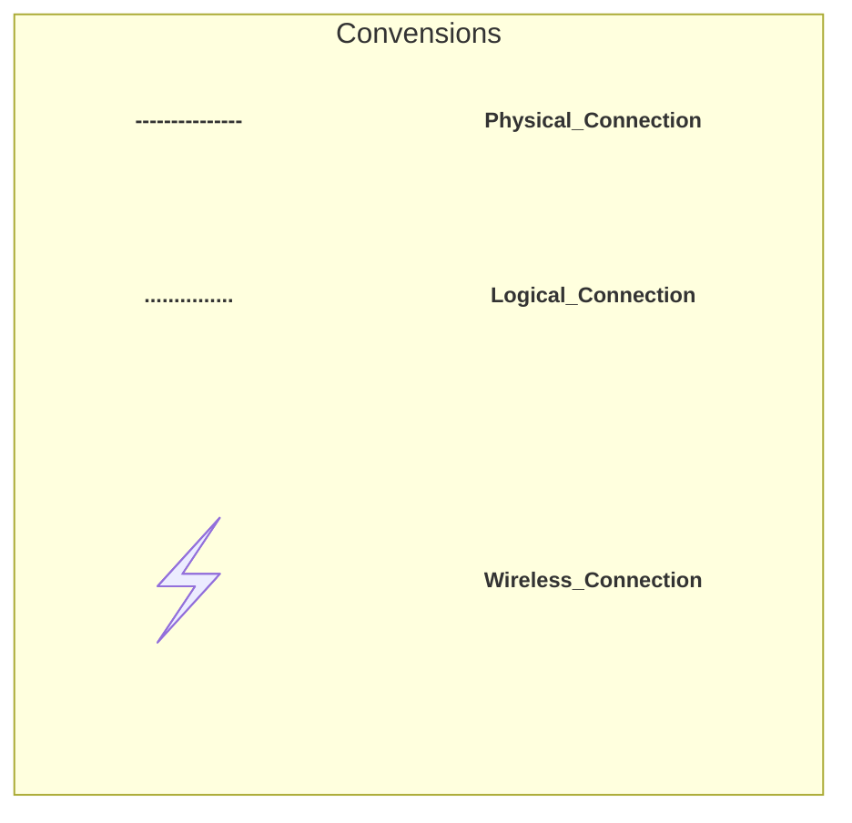

```mermaid
---
title: Home_Lab-HLD
---
flowchart TB

%% =========================
%% Lab Infrastructure
%% =========================
subgraph LAB["Lab Infrastructure"]
  direction TB
  subgraph LAN_SW["Core Switch"]
     %% Cisco image with a constrained aspect ratio
    C@{ img: "https://imgs.search.brave.com/eeYhUM-CsrEyiHON37NPdrKDf0WFWLh8rgRF-VAkIcg/rs:fit:860:0:0:0/g:ce/aHR0cHM6Ly93d3cu/Y2l0eXBuZy5jb20v/cHVibGljL3VwbG9h/ZHMvcHJldmlldy9j/aXNjby1ibHVlLWxv/Z28tcG5nLTczNTgx/MTY5NjYxMDAxMHV0/amhldmJ4Y2wucG5n", pos: "t", h: 60, constraint: "on" }
  end

   %% OPNsense VM
  subgraph OPNsense ["OPNsense"]
    direction TB
    %% Physical NICs
    OPN_WAN((WAN))
    OPN_LAN((LAN))
     %% OPNSense image with a constrained aspect ratio
    A@{ img: "https://opnsense.org/wp-content/themes/template/assets/images/logo-opnsense.svg", pos: "t", h: 60, constraint: "on" }
  end

LAN_SW --- OPN_WAN
LAN_SW --trunk--> OPN_LAN

end


%% =========================
%% Lenovo PC
%% =========================
subgraph lenovo["Lenovo PC"]
%% Physical NIC
L_NIC["NIC"]
  subgraph proxmox3["Proxmox 3"]
  %% Proxmox image with a constrained aspect ratio
    P@{ img: "https://raw.githubusercontent.com/librenms/librenms/289ad04ca211839493c3a56fce3e631505e898e2/html/images/os/proxmox.svg", pos: "t", h: 60, constraint: "on" }
    subgraph Homeassistant
      %% Homeassistant image with a constrained aspect ratio
      H@{ img: "https://github.com/home-assistant/assets/blob/master/misc/loading-screen.gif?raw=true", pos: "t", h: 60, constraint: "on" }
    end

  subgraph LibreNMS
    %% LibreNMS image with a constrained aspect ratio
      L@{ img: "https://raw.githubusercontent.com/librenms/librenms/289ad04ca211839493c3a56fce3e631505e898e2/doc/img/librenms.svg", pos: "t", h: 60, constraint: "on" }
  end
  subgraph Nextcloud
    %% Nextcloud image with a constrained aspect ratio
      N@{ img: "https://nextcloud.com/c/uploads/2022/11/logo_nextcloud_blue.svg", pos: "t", h: 60, constraint: "on" }
  end
  subgraph SAS
    %% Cloudflare image with a constrained aspect ratio
      S@{ img: "https://avatars.githubusercontent.com/u/314135?s=200&v=4", pos: "t", h: 60, constraint: "on" }
  end
  end
end
%% =========================
%% PHYSICAL CONNECTIONS
%% =========================

%% Link 2
%% OPNsense---lenovo 


%% =========================
%% Logical Connections
%% =========================

OPN_LAN -.IOT, MGMT, SAS-.-> L_NIC

L_NIC -.IOT VLAN-.- Homeassistant
L_NIC -.MGMT VLAN-.- LibreNMS
L_NIC -.SAS VLAN -.- Nextcloud
L_NIC -.SAS VLAN -.- SAS
LAN_SW --Trunk--> L_NIC
  %% =========================
  %% STYLING
  %% =========================
%% linkStyle 2 stroke-width:0px;


%% Subgraph styling
  style LibreNMS fill:#e0f2fe,stroke:#0369a1,stroke-width:2px;
  style Homeassistant fill:#e0f2fe,stroke:#0369a1,stroke-width:2px;
  style Nextcloud fill:#e0f2fe,stroke:#0369a1,stroke-width:2px;
  style SAS fill:#e0f2fe,stroke:#0369a1,stroke-width:2px;
```


