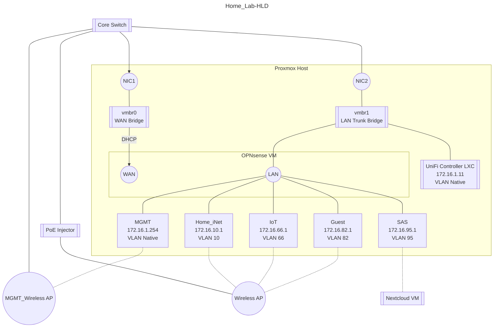
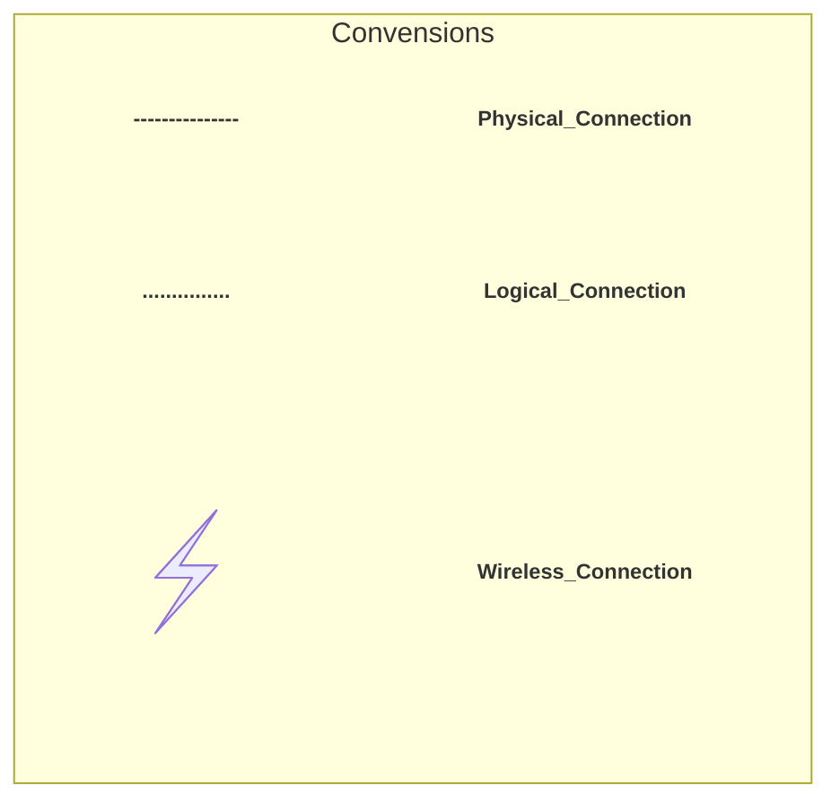

```mermaid
---
title: Home_Lab-HLD
---
flowchart TB

%% Devices
LAN_SW[[Core Switch]]
PoE[[PoE Injector]]
WAP((Wireless AP))
WAP2((MGMT_Wireless AP))
Nextcloud[[Nextcloud VM]]


%% =========================
%% ZimaBoard
%% =========================
subgraph Proxmox1 ["Proxmox Host"]
direction TB

  %% Physical NICs
  Port1((NIC1))
  Port2((NIC2))

  %% Linux Bridges
  VMBR0[[vmbr0<br/>WAN Bridge]]
  VMBR1[[vmbr1<br/>LAN Trunk Bridge]]

  Port1 --- VMBR0
  Port2 --- VMBR1

  %% OPNsense VM
  subgraph OPNsense_VM ["OPNsense VM"]
    direction TB
    OPN_WAN((WAN))
    OPN_LAN((LAN))
  end

  VMBR0 -- DHCP --> OPN_WAN
  VMBR1 --- OPN_LAN

  %% VLAN Interfaces
  MGMT["MGMT<br/>172.16.1.254<br/>VLAN Native"]
  HOME["Home_iNet<br/>172.16.10.1<br/>VLAN 10"]
  IOT["IoT<br/>172.16.66.1<br/>VLAN 66"]
  GUEST["Guest<br/>172.16.82.1<br/>VLAN 82"]
  SAS["SAS<br/>172.16.95.1<br/>VLAN 95"]

  OPN_LAN --- MGMT
  OPN_LAN --- HOME
  OPN_LAN --- IOT
  OPN_LAN --- GUEST
  OPN_LAN --- SAS

  %% UniFi Controller VM
  UNIFI[[UniFi Controller LXC <br/>172.16.1.11<br/>VLAN Native]]
  VMBR1 --- UNIFI
end

%% =========================
%% PHYSICAL CONNECTIONS
%% =========================
LAN_SW --- WAP2
LAN_SW --- PoE
LAN_SW ---> Port1
LAN_SW <--- Port2
PoE --- WAP

%% Logical Connections

HOME -.- WAP
IOT -.- WAP
GUEST -.- WAP
MGMT -.- WAP2
SAS -.- Nextcloud
```

```mermaid
%% ---
%% title: Convensions
%% ---
flowchart TB
subgraph Convensions
Solid["---------------"]
Dotted["..............."]
subgraph Bolt[" "]
A@{ shape: bolt, label: "Communication link" }
end


  Solid --- Physical_Connection
  Dotted --- Logical_Connection
  Bolt --- Wireless_Connection

end
  %% =========================
  %% STYLING
  %% =========================
    linkStyle 0,1,2 stroke-width:0px;
    classDef square fill:transparent,stroke:transparent,font-weight:bold,font-size:12px;
    class Solid,Dotted,Bolt,Wireless_Connection,Logical_Connection,Physical_Connection square;
```